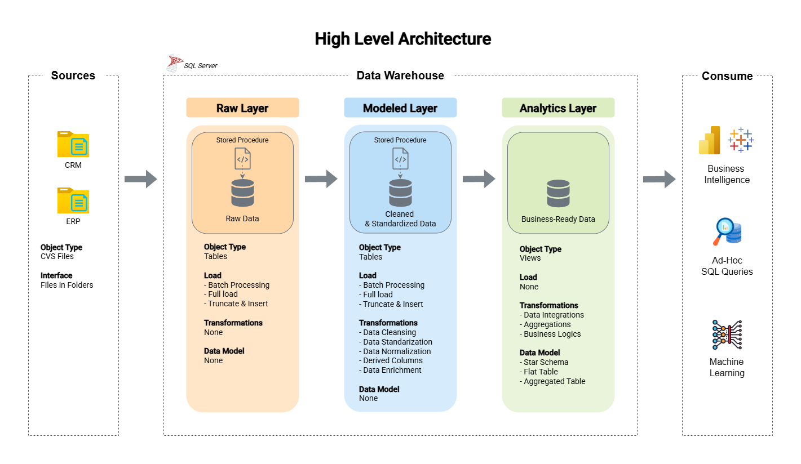
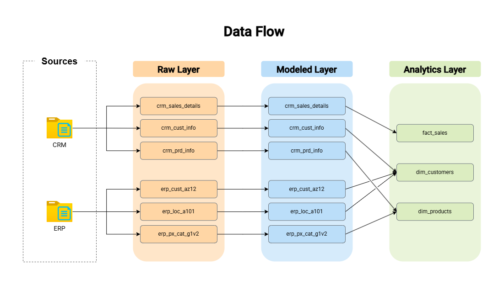
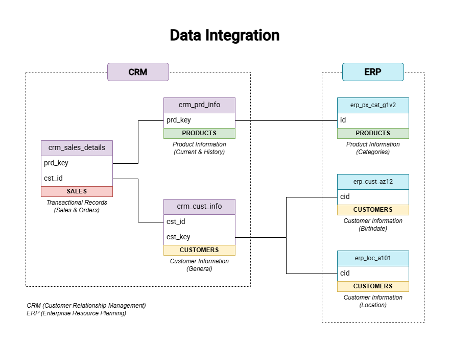

# Data Warehouse and Analytics Project

## 🏗️ Data Architecture

This project implements a **modern SQL Server Data Warehouse** designed to integrate data from multiple source systems and support analytical reporting.

The architecture follows a layered approach inspired by the **Medallion Architecture** pattern.



### Layers of the Data Warehouse

**Raw Layer**

- Stores source data ingested directly from CRM and ERP systems.
- Data is loaded from CSV files without transformations.
- Serves as the staging area for the ETL pipeline.

**Modeled Layer**

- Performs data cleansing and standardization.
- Resolves data quality issues.
- Aligns data types and structures across different source systems.
- Prepares integrated datasets for analytical modeling.

**Analytics Layer**

- Provides business-ready data structures.
- Implements a **Star Schema** composed of dimension and fact views.
- Optimized for analytical queries and reporting.

---
## 🔄 Data Flow

The following diagram illustrates the **data movement and transformation flow** from the source systems through the warehouse layers to the final analytics model.



---

## 🔗 Data Integration

The project integrates data from multiple operational systems into a **single analytical model**.



Key integration processes include:

- Combining **CRM customer data** with **ERP location and demographic data**
- Linking **sales transactions** with product and customer dimensions
- Standardizing attributes such as gender, marital status, and product categories
- Creating a unified data model optimized for analysis
---

## 📊 Data Analysis with SQL

A key objective of this project is to demonstrate how **SQL can be used to perform end-to-end data analysis directly inside the database**, without relying on external tools such as Excel or BI platforms.

The analytical layer is built on top of the Star Schema and includes several SQL scripts that explore the data, generate business metrics, and create analytical reports.

### Exploratory Data Analysis

The project includes SQL scripts that perform exploratory analysis of the warehouse data, including:

- exploration of database metadata and dimensional attributes
- calculation of key business KPIs
- distribution and magnitude analysis
- ranking of top and bottom performing entities

Example insights generated using SQL include:

- total revenue and quantity sold
- customer distribution by country and gender
- product distribution by category
- top and bottom performing products
- top customers by revenue


### Advanced Analytical Queries

More advanced SQL techniques are used to analyze trends and patterns in the data, including:

- **time-series analysis** of monthly sales performance
- **running totals and cumulative metrics**
- **year-over-year product performance comparisons**
- **category contribution to overall revenue**
- **customer segmentation based on purchasing behaviour**

These analyses demonstrate the use of advanced SQL features such as:

- window functions
- common table expressions (CTEs)
- analytical aggregations
- ranking functions

### Analytical Reports

The project also includes two analytical report views designed to support common business analysis scenarios.

**Customer Report**

Provides a consolidated view of customer purchasing behaviour, including spending patterns, order activity, and customer segmentation.  
This report can be used to identify high-value customers, analyze retention, and support marketing or customer strategy decisions.

**Product Report**

Summarizes product sales performance across orders, customers, and revenue.  
This report helps identify top-performing products, underperforming items, and overall product demand trends to support product and sales decisions.

---

## 🎯 Skills Demonstrated

This project highlights practical skills in:

- SQL Development
- Data Warehouse Design
- ETL Pipeline Development
- Dimensional Data Modeling
- Data Quality Validation
- Exploratory Data Analysis
- Analytical SQL Reporting

---

## 📂 Repository Structure
```
sql-data-warehouse-project/
│
├── datasets/                                    # Source datasets used in the project
│   ├── source_crm/                              # CRM system datasets
│   └── source_erp/                              # ERP system datasets
│
├── docs/                                        # Architecture and project documentation
│   ├── high_level_architecture.drawio           # High-level architecture of the data warehouse
│   ├── data_flow.drawio                         # Data flow diagram showing ETL pipeline
│   └── data_integration.drawio                  # Data integration diagram between source systems
│
├── scripts/                                     # SQL scripts implementing the data warehouse pipeline
│   ├── raw_layer/                               # Raw layer – source data ingestion
│   │   ├── init_database.sql                    # Creates the DataWarehouse database and schemas
│   │   ├── ddl_raw_layer.sql                    # Defines raw tables mirroring source systems
│   │   └── proc_load_raw_layer.sql              # Loads CSV source data into raw tables
│   │
│   ├── modeled_layer/                           # Modeled layer – data cleansing and standardization
│   │   ├── ddl_modeled_layer.sql                # Creates cleaned and standardized modeled tables
│   │   └── proc_load_modeled_layer.sql          # Transforms and loads data from raw to modeled layer
│   │
│   ├── analytics_layer/                         # Analytics layer – dimensional model (Star Schema)
│   │   └── ddl_analytics_layer.sql              # Creates dimension and fact views for analytics
│   │
│   ├── quality_checks/                          # Data quality validation scripts
│   │   ├── quality_checks_modeled.sql           # Validates data quality in the modeled layer
│   │   └── quality_checks_analytics.sql         # Validates Star Schema integrity and relationships
│   │
│   ├── data_analysis/                           # Exploratory and analytical SQL queries
│   │   ├── basic_exploratory_data_analysis.sql  # Basic EDA on the analytics layer
│   │   ├── adv_exploratory_data_analysis.sql    # Advanced analytical queries and trend analysis
│   │   ├── report_customers.sql                 # Customer analytical report view
│   │   └── report_products.sql                  # Product analytical report view
│
├── README.md                                    # Project overview and documentation
└── LICENSE                                      # Repository license
```
---
## 🙏 Credits

This project was developed as part of the learning materials provided by **Data With Baraa**.

Full credit goes to **Baraa Khatib Salkini (Data With Baraa)** for the educational content and project inspiration.

- GitHub Repository: https://github.com/DataWithBaraa/sql-data-warehouse-project  
- YouTube Channel: https://www.youtube.com/@DataWithBaraa

The course and materials provided the foundation for this project, while the implementation, documentation, and analysis were completed as part of my personal portfolio work.

